```
    name: sahil v patel
    course: cis 106
    semester: spring 23
```

# Deliverable 1

### Concepts that I Didnt Understand:

**Read the tutorial. Write down every concept you don’t understand and research them.**
## 1 )` systemctl ` - **In Linux, systemctl is a command-line utility that is used to control and communicate with the systemd system and service manager. systemd is a system and service manager for Linux operating systems that provides a range of features, including managing the services that run on a system.**

**EXAMPLE : When it comes to Apache and systemctl, it is often used to start, stop, restart, enable, or disable the Apache HTTP Server.**
## Start Apache:
`sudo systemctl start apache2`: Start Apache
`sudo systemctl stop apache2` : Stop Apache

## 2) `/var/log/apache2/access.log` **is the default location for the Apache HTTP Server access log on Debian-based Linux distributions, such as Ubuntu. In Apache, the access log records all requests made to the server, including details such as the requesting IP address, the requested resource, the HTTP status code, and the user agent.**

## EXAMPLE:

**/var: This directory typically contains variable data files.**

**/log: This is a conventional name for log files.**

**/apache2: This subdirectory is specific to Apache logs, separating them from other system logs.**

**access.log: This is the actual log file that records information about every request made to the Apache server.**

## 3) `a2enconf` : command in Apache is used to enable a configuration file for a particular Apache module or feature. This command is often used on Debian-based systems, such as Ubuntu, where Apache configurations are organized using a modular structure.

## EXAMPLE: 
`sudo a2enconf <conf-name>`: <conf-name> is the name of the configuration file you want to enable.


## Answer The following questions:

## Basic Terminology

## What is a Web Server? Hardware and Software side ?
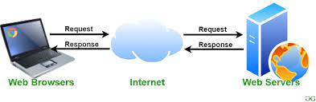 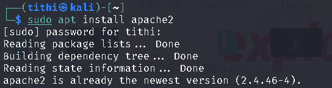

**A web server is a crucial component in the infrastructure of the World Wide Web, responsible for delivering web pages to users' browsers. It operates on both hardware and software levels.**
-   **On the hardware side, a web server typically consists of a computer system specifically designed to handle web hosting tasks. This computer is equipped with components like a processor, memory (RAM), storage (hard drive or SSD), and network interface cards. The hardware should be capable of handling concurrent requests, meaning it needs sufficient processing power and memory to respond to multiple users simultaneously.**
    
-    **On the software side, a web server relies on specialized programs to process and respond to incoming requests. Commonly used web server software includes Apache, Nginx, and Microsoft Internet Information Services (IIS). These software packages manage the communication between the server hardware and the user's web browser, handling tasks such as processing HTTP requests, executing server-side scripts (e.g., PHP or Python scripts), and sending back the requested web pages.**

## What are some different web server applications ?

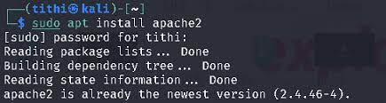 

## Apache HTTP Server:
**Definition: Apache is one of the most popular open-source web server software. It's known for its flexibility, stability, and scalability. Apache supports a variety of features, including the ability to serve static and dynamic content, handle virtual hosts, and support various programming languages. It works on multiple operating systems, making it a versatile choice for web hosting.**

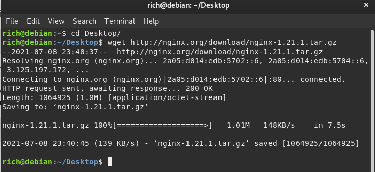 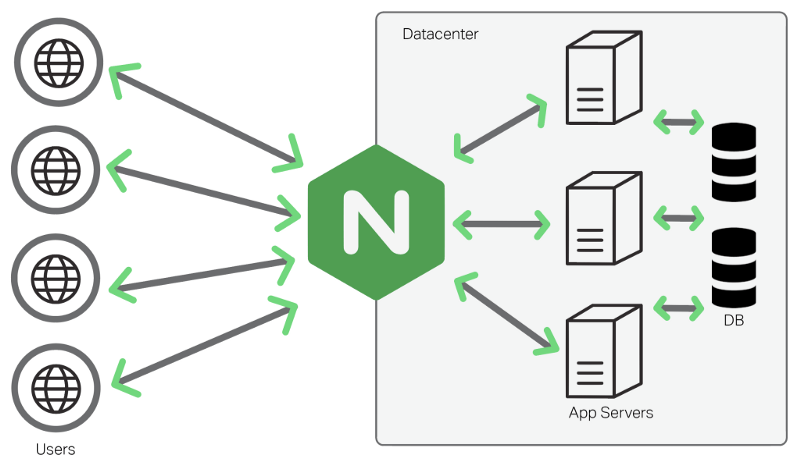
## Nginx:
**Definition: Nginx, pronounced "engine-x," is a lightweight, high-performance web server and reverse proxy server. It's designed to efficiently handle a large number of concurrent connections and is often used to improve the performance and scalability of websites. Nginx excels at serving static content quickly and can also act as a load balancer to distribute incoming traffic across multiple servers, enhancing overall system reliability.**

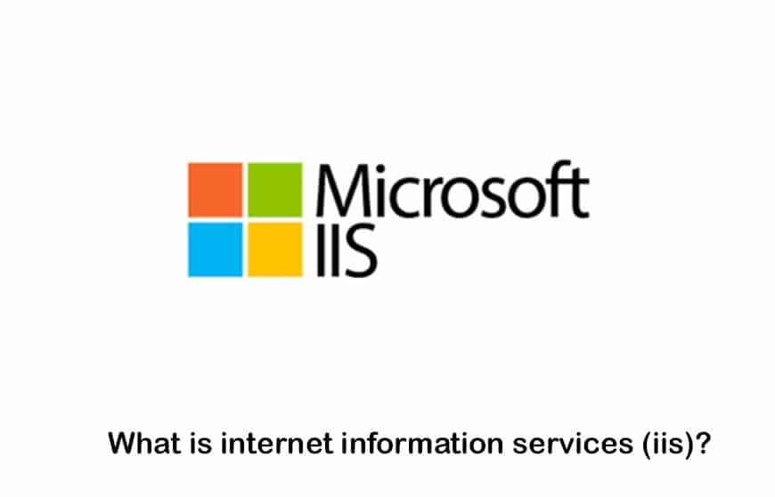
## Microsoft Internet Information Services (IIS):
**Definition: IIS is a web server application developed by Microsoft for Windows Server operating systems. It is tightly integrated with the Windows environment and provides support for various Microsoft technologies such as ASP.NET and Microsoft SQL Server. IIS is user-friendly and offers features like security controls, application hosting, and support for various web protocols. It's a common choice for organizations using Windows-based servers.**

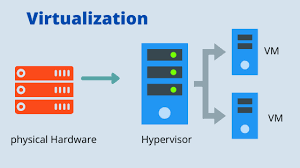
## What is virtualization ?
**Virtualization is a technology that allows multiple operating systems (OS) or applications to run on a single physical machine, referred to as the host. It creates a virtualized environment where each operating system or application operates independently, as if it were running on a dedicated physical server. This is achieved by using a hypervisor, which is a layer of software or firmware that sits between the hardware and the virtualized systems. The hypervisor allocates and manages the resources of the host machine, such as CPU, memory, and storage, among the virtualized instances. Virtualization is widely used in data centers, server environments, and for desktop computing to improve resource utilization, increase flexibility, and enhance scalability.**

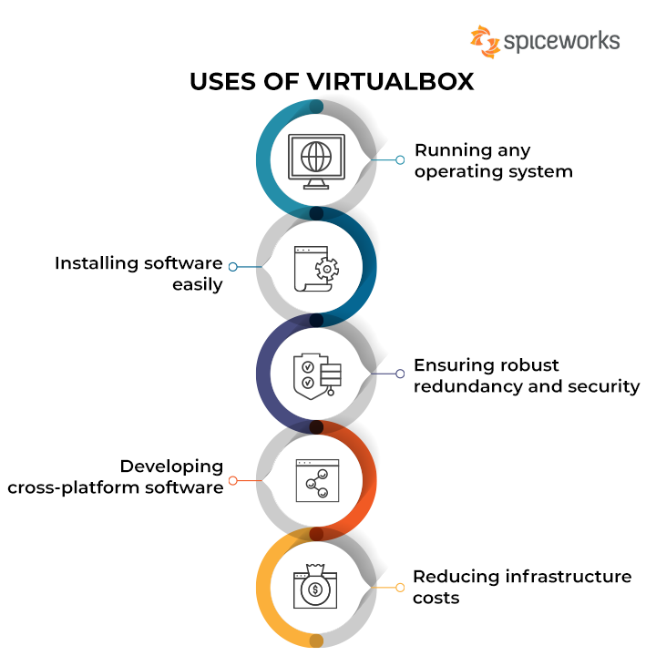
## What is virtualbox ?
**VirtualBox is a free and open-source virtualization platform developed by Oracle. It allows users to create and manage virtual machines (VMs) on their computers. VirtualBox supports various host operating systems, including Windows, macOS, Linux, and Solaris, making it a versatile choice for different users. With VirtualBox, you can run multiple virtual machines simultaneously, each running its own guest operating system. For example, you could run a Linux VM on a Windows host or vice versa.**

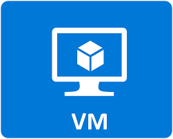
## What is a virtual machine ?
**A virtual machine (VM) is a software-based emulation of a physical computer. It runs an operating system (known as the guest OS) within another operating system (known as the host OS). Virtual machines are created by virtualization software or a hypervisor, which allocates a portion of the host machine's resources (such as CPU, memory, and storage) to the virtual machine. VMs operate independently, allowing multiple operating systems to run on a single physical machine. This technology is widely used in server environments, development and testing scenarios, and desktop computing to enhance flexibility, resource utilization, and isolation.**


## What is Ubuntu Server ?
**Ubuntu Server is a version of the Ubuntu operating system specifically designed for server environments. It is based on the Debian Linux distribution and is known for its ease of use, stability, and strong community support. Ubuntu Server is a popular choice for various server applications, ranging from web hosting and file servers to database management and cloud computing.**

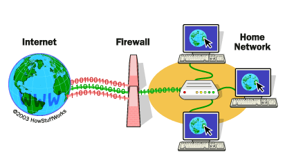
## What is a firewall?
**A firewall is a network security system that monitors and controls incoming and outgoing network traffic based on predetermined security rules. Its primary purpose is to establish a barrier between a trusted internal network and untrusted external networks, such as the internet. Firewalls can be implemented in both hardware and software forms and are essential for protecting computer systems and networks from unauthorized access, malicious activities, and potential security threats. Firewalls use various techniques, such as packet filtering, proxying, and stateful inspection, to determine whether to allow or block traffic.**

## Example: 
**- Imagine a corporate network with a firewall in place. The firewall might be configured to allow incoming traffic on specific ports, such as port 80 for HTTP or port 443 for HTTPS, to reach the web server. However, it could block incoming traffic on other ports to protect against potential security threats. Outgoing traffic might also be restricted, ensuring that sensitive data doesn't leave the network without proper authorization.**

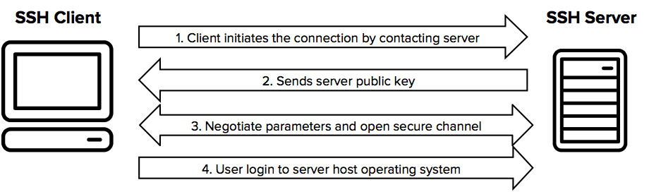
## What is SSH ?
**SSH, or Secure Shell, is a cryptographic network protocol used for secure communication over a potentially unsecured network. It allows users to access and control remote systems securely, providing a secure alternative to traditional, unencrypted methods like Telnet. SSH encrypts the data exchanged between the client and the server, preventing unauthorized access and protecting the confidentiality and integrity of the communication.**

## Example:
**- Let's say an administrator needs to securely access a remote server. They can use SSH to establish a secure connection. The command might look like this: ssh username@remote_server. The user would then enter their password (or use key-based authentication) to gain access. Once connected, the administrator can execute commands on the remote server as if they were physically present, all within an encrypted and secure communication channel.**


#THE END
