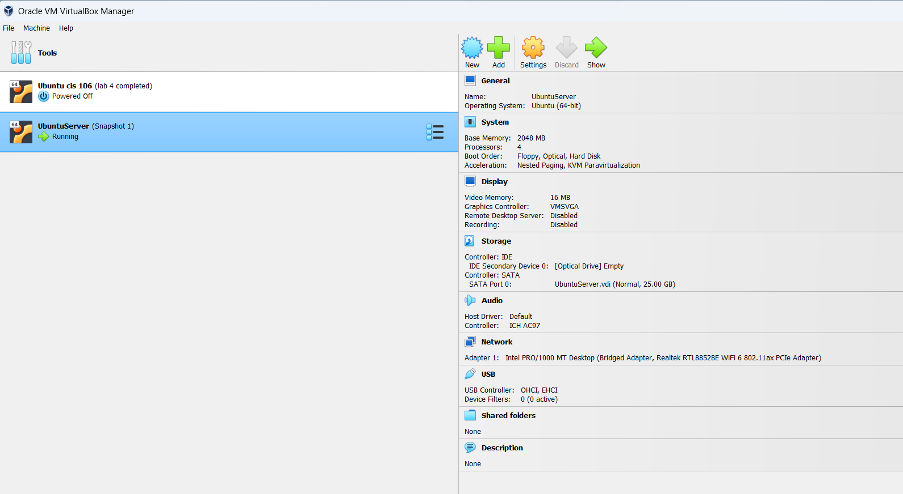
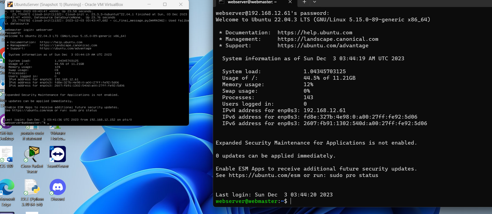

```
  name: sahil v patel
    course: cis 106
    semester: spring 23
```


# Deliverable 2

## 1. What are the server hardware specifications (virtual machine settings)? 


## 2. What is Ubuntu server log in screen? 


## 3. What is the IP address of your Ubuntu Server Virtual Machine?
`192.168.12.61`

## 4. How do you enable the Ubuntu Firewall?
`sudo ufw enable`

## 5. How do you check if the Ubuntu Firewall is running?
`sudo ufw status`

## 6. How do you disable the Ubuntu Firewall?
`sudo ufw disable`

## 7. How do you add Apache to the Firewall?
`sudo ufw allow 'Apache'`

## 8. What is the command you used to install Apache?
`apt-get install apache2`

## 9. What is the command you use to check if Apache is running?
`sudo systemctl status apache2`

## 10. What is the command you use to stop Apache?
`sudo systemctl stop apache2`

## 11. What is the command you use to restart Apache?
`sudo systemctl restart apache2`

## 12. What is the command used to test Apache configuration?
`sudo apache2ctl configtest`

## 13. What is the command used to check the installed version of Apache? 
`apache2 -v`

## 14. What are the most common commands to troubleshoot Apache errors? Provide a brief description of each command.
`sudo systemctl status apache2`: This command provides the current status of the Apache service, including whether it is active, inactive, or encountering errors.

`sudo apachectl configtest`: Verifies the syntax of your Apache configuration files without restarting the server. It helps identify syntax errors in your configuration.
`sudo tail -f /var/log/apache2/error.log`: Displays the last few lines of the Apache error for monitoring errors as they occur.

## 15. Which are Apache Log Files, and what are they used for? Provide examples and screenshots.
***Access Log:***
Location: Typically found in the logs directory of the Apache installation.
Purpose: Records all requests made to the server, including details such as the IP address of the client, the requested resource, the HTTP status code, and the user agent.
**Example: sudo tail -n 20 /var/log/apache2/error.log**
command:
***Error Log:***
Location: Also found in the logs directory.
Purpose: Captures information about server errors, warnings, and other critical events. It helps administrators diagnose and address issues.
**Example:sudo tail -n 20 /var/log/apache2/access.log**

# FINISHED