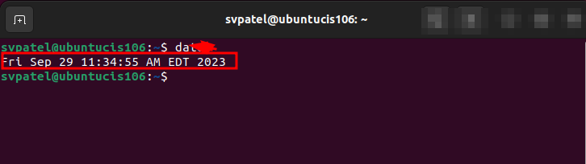

```
    name : sahil v patel
    course: cis 106
    date: 10/08/23
```
# lab 3 submission:

## question 1:

## question 2:

## question 3:
| Program purpose     | Package Name | Version              |
| ------------------- | ------------ | ---------------------|
| Play a tetris game  | blockattack  | (2.7.0-1)            |
| Play a video file   | dragon player| (4:21.12.3-0ubuntu1) |
| Browse the internet |  epiphany    | 42.4-0ubuntu1        |
| Read your email     |  mailspring  | 1.11.0               |
| Play music          |    lollypop  | (1.4.33-1 )          |

## question 4:
| command | what it does                                                                         |
| ------- | ------------------------------------------------------------------------------------ |
| echo    | display or print text                                                                |
| fortune | display collection of quotes                                                         |
| cowsay  | It gives cow in terminal                                                             |
| lolcat  |   it customizes the appearance of output                                             |
| figlet  |   creates some appealing and amazing ASCII TEXT BANNER                               |
| toilet  |   prints text using large characters made of smaller characters                      |
| rig     |   rig is a command-line utility that generates random names and addresses.           |

