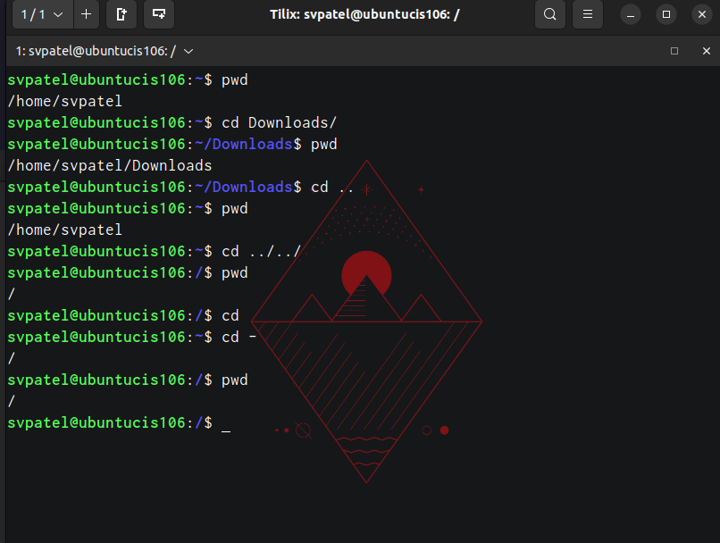
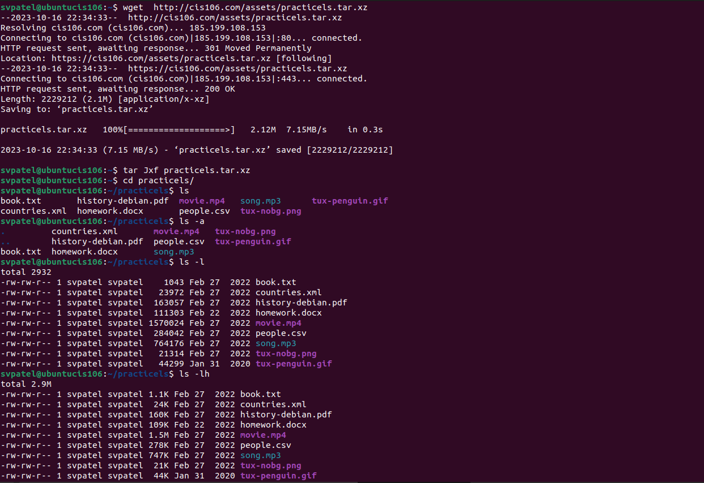
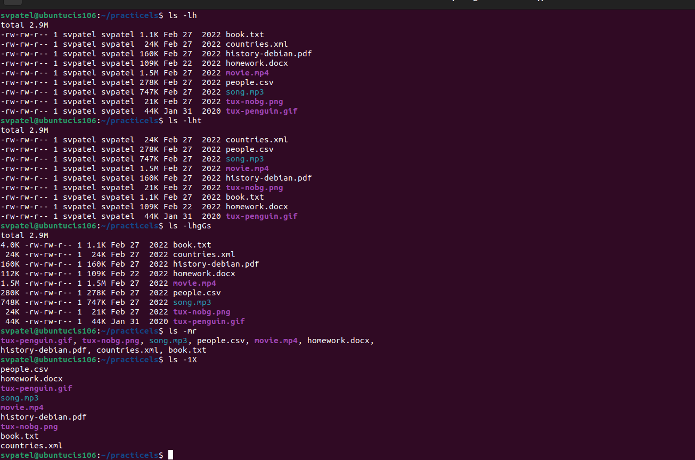
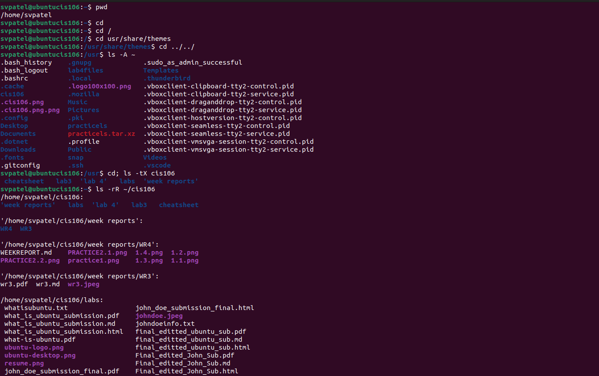
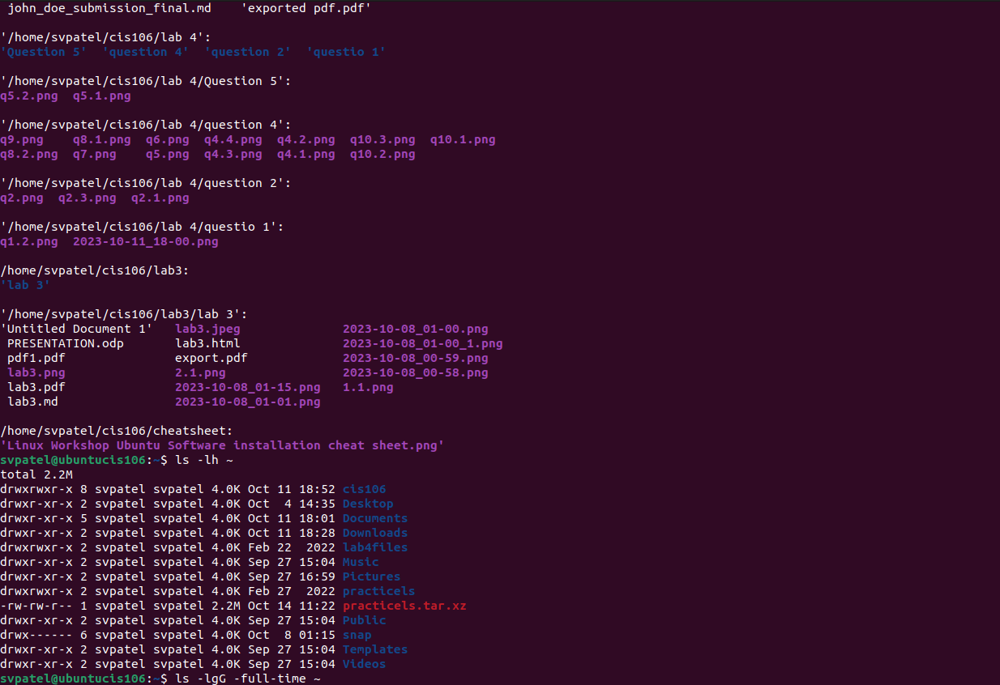
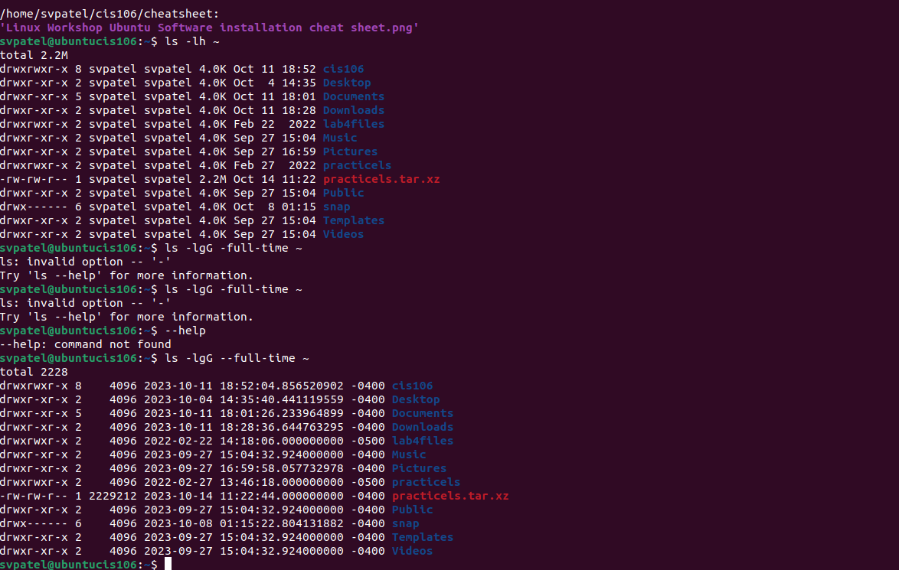
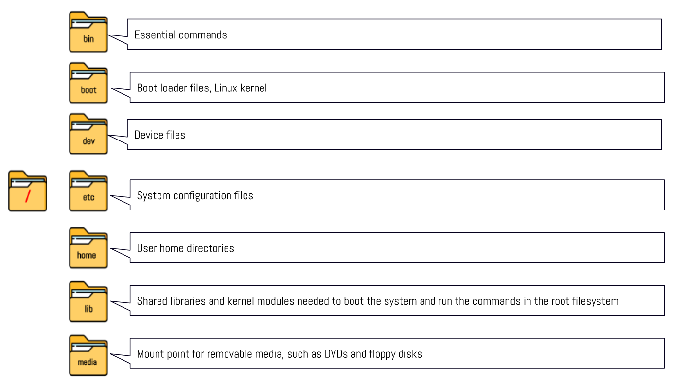
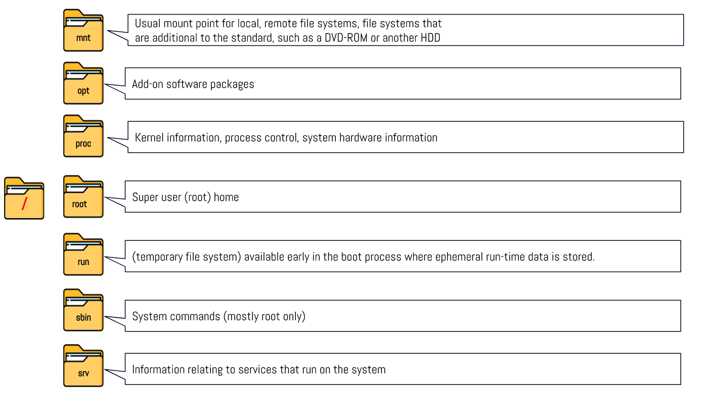
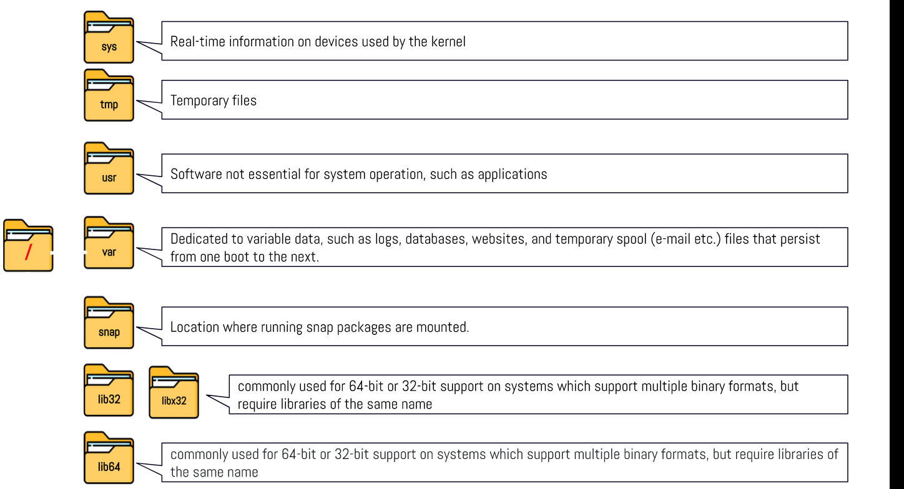

```
    name: sahil v patel
    course: cis 106
    semester: spring 23
```
# Week Report 4

## Practice from the presentation The Linux File System:
### Practice 1



### Practice 2




### Practice 3





## The Linux from the presentation The Linux File System:
<br>
<br>
<br>

## All the commands for navigating the filesystem

| Command | What it does                                                           | Syntax | Example |
| ------- | ---------------------------------------------------------------------- | ------ | ------- |
| pwd     | prints current directory                                               | pwd    | `pwd `  |
| cd      | return to home directory                                               | cd     | `cd`    |
| ls      | To display the files and directories in your current working directory | ls     | `ls`    |

## Basic terminology

* **File System:**
A file system is a method and data structure used by an operating system to manage and organize files on a storage device, such as a hard drive or SSD. It provides a hierarchical structure for storing, retrieving, and managing data.


* **Current Directory:**
The current directory, often denoted by a single dot (.) in Linux, represents the directory in which you are currently working. Any file or directory operations you perform are relative to the current directory unless you specify an absolute path.


* **Parent Directory:**
The parent directory, represented by two dots (..) in Linux, refers to the directory one level up in the directory hierarchy. It is the directory that contains the current directory.


* **Home Directory:**
The home directory, often referred to as "~" (tilde), is the default directory for a specific user in Linux. Each user has their own home directory, and it is the directory in which the user starts when they log in. It is also where user-specific configuration files and personal data are typically stored.


* **The Difference Between Your Home Directory and the Home Directory:**
Your home directory is a specific user's personal directory where they have their own files and settings. The "home directory" typically refers to the base directory containing all user home directories on a system. Each user's home directory is a subdirectory within the "home directory."

* **Pathname:**
A pathname is a string that describes the location of a file or directory within a file system. It can be either an absolute path or a relative path and is used to navigate and locate files and directories in the file system.

* **Relative Path:**
A relative path specifies the location of a file or directory in relation to the current directory. It doesn't start from the root directory and typically involves navigating up or down the directory hierarchy using symbols like ".." (parent directory) and directory names.


* **Absolute Path:**
An absolute path specifies the precise location of a file or directory from the root of the file system. It begins with a forward slash ("/") in Linux and provides the full path from the root directory to the target file or directory. It doesn't depend on the current directory and remains constant regardless of where you are in the file system.


