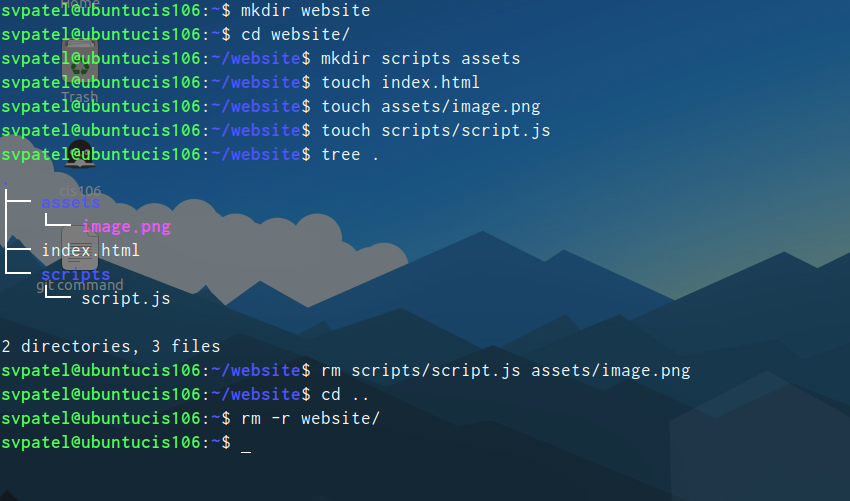
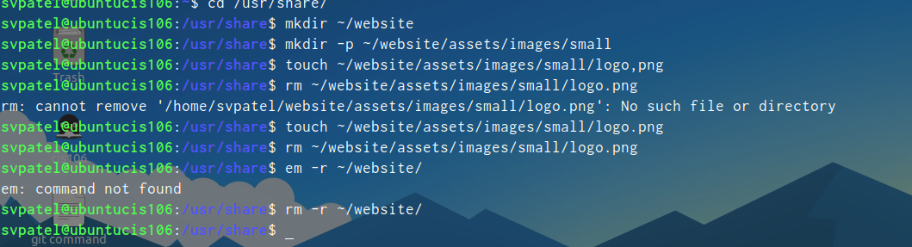
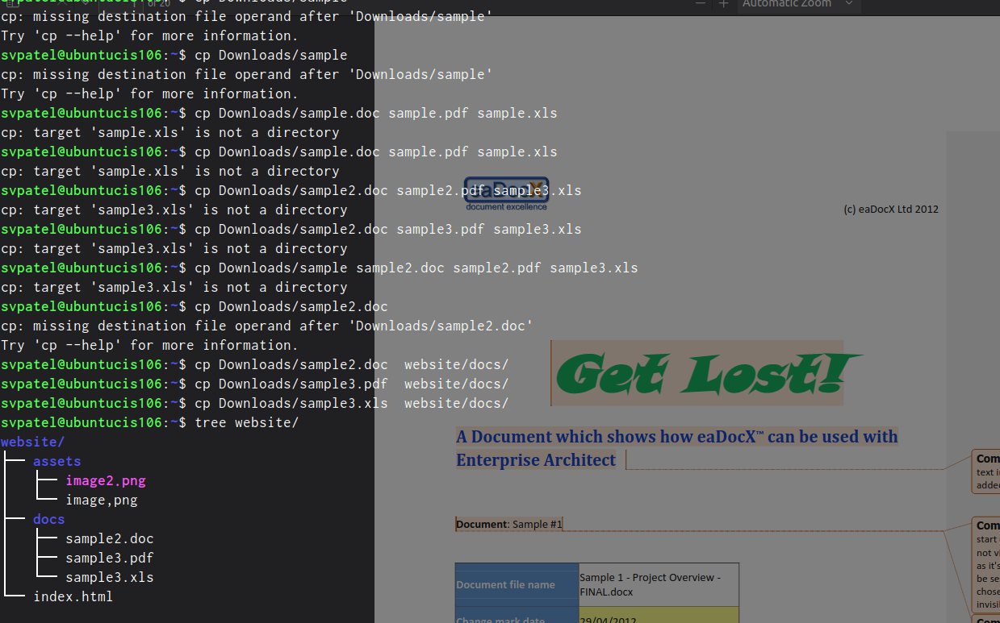

```
    name: sahil v patel
    course: cis 106
    semester: spring 23
```
# WeekReport5 

1. **What are Command Options?**

   Command options are extra settings or modifications you can add to a command to change its behavior. They usually start with a hyphen (-) and are used to customize how a command operates. For example, in the command `ls -l`, the `-l` is an option that tells the `ls` command to display detailed information about files.

2. **What are Command Arguments?**

   Command arguments are the inputs you provide to a command to specify what it should operate on or how it should perform a task. For instance, in the command `cp file1.txt folder/`, `file1.txt` and `folder/` are arguments. They tell the `cp` command which file to copy and where to copy it.

3. **Which command is used for creating directories? Provide at least 3 examples.**

   The `mkdir` command is used for creating directories. Here are three examples:

   - Create a directory named "photos": `mkdir data`
   - Create multiple directories named "cis116," "cis202," and "cis212": `mkdir cis116 cis202 cis212`
   - Create a parent directory named "projects" with a subdirectory named "documents": `mkdir -p projects/documents`

4. **What does the touch command do? Provide at least 3 examples.**

   The `touch` command is used to create empty files or update the access and modification timestamps of existing files. Here are three examples:

   - Create a new empty file named "notes.txt": `touch notes.txt`
   - Update the timestamp of an existing file named "file1.txt": `touch file1.txt`
   - Create multiple empty files named "file1," "file2," and "file3": `touch file1 file2 file3`

5. **How do you remove a file? Provide an example.**

   The `rm` command is used to remove files. For example, to remove a file named "example.txt," you would use:

   
    `rm example.txt`
   

6. **How do you remove a directory, and can you remove non-empty directories in Linux? Provide an example.**

   To remove an empty directory, you can use the `rmdir` command. To remove a non-empty directory, you use the `rm` command with the `-r` option. For example:

   - Remove an empty directory named "cis116": `cis116`
   - Remove a non-empty directory named "cis202" and its contents: `cis202`

7. **Explain the mv and cp command. Provide at least 2 examples of each.**

   - The `mv` command is used to move or rename files and directories. Examples:
     - Move a file named "data.txt" to a directory named "documents": `mv data.txt documents/`
     - Rename a directory from "data" to "newdata": `mv data newdata`

   - The `cp` command is used to copy files and directories. Examples:
     - Copy a file named "image.jpg" to pictures  folder: `cp image.jpg /pictures`
     - Copy a directory named "root" and its contents to a new location: `cp -r root/ newlocation/`
  
# Practices:
## Practice 1:

## Practice 2:

## Practice 3:

## Practice 4:


## Completed