```
    name: sahil v patel
    course: cis 106
    semester: spring 23
```
# WEEK REPORTS 6

## WILDCARDS.

### Wildcards. At least 3 examples per wildcard (*,?,[]) 
## ( * )
* EXAMPLES:
  * List all the text file in a directory
    * `ls *.txt`
  * List all the files that start with word files.
    * `ls file*`
  * copy all the mp4 files
    * `cp download/*.mp4 ~/videos/movies/`
## ( ? )
* Examples:
* Lists file with single character
  *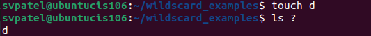
* Display files with a specific extension and a single character before the extension
  *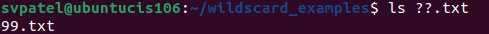 
* Remove files with a single-character name
  *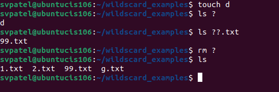 

## ( [] )
* Matches a Range of Characters:
    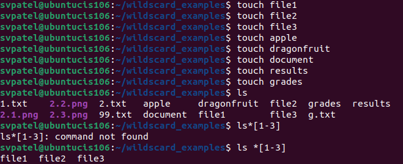 
* Matches a Set of Characters:
    
* Excluding Characters:
    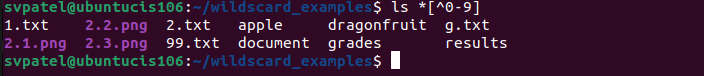

# Practice
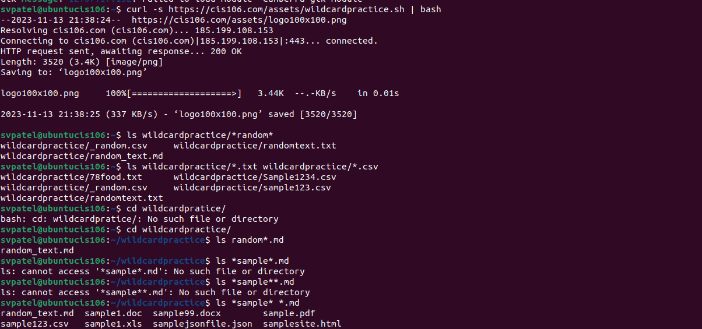

# Practice
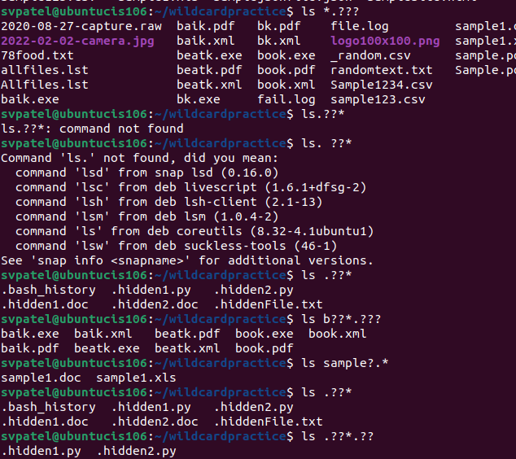

# Practice 3
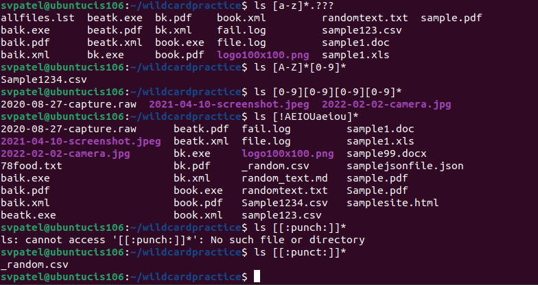

# Expansion
* To Create a whole directory in a single command
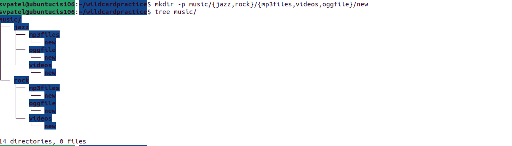

* To Create a N number of files:
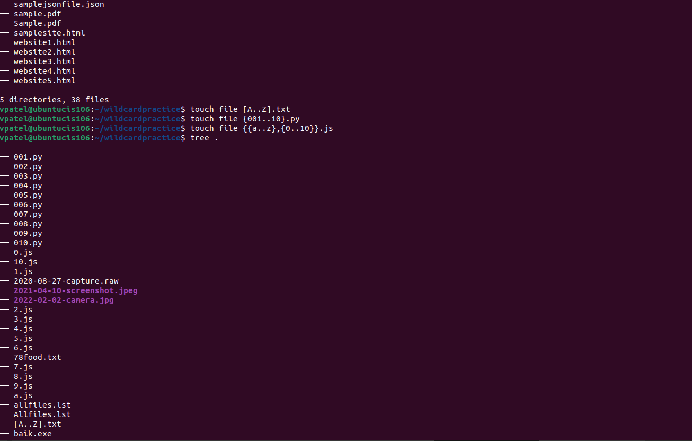 
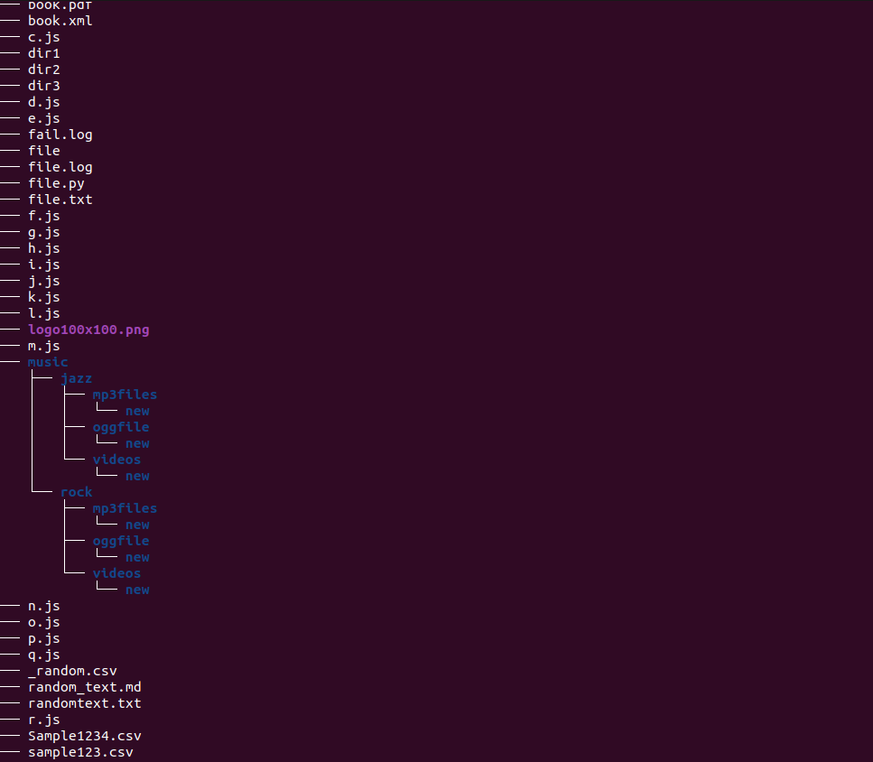 
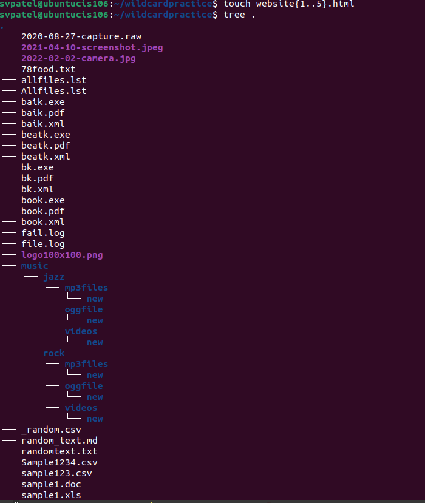 

* Remove multiple files in a single directory:
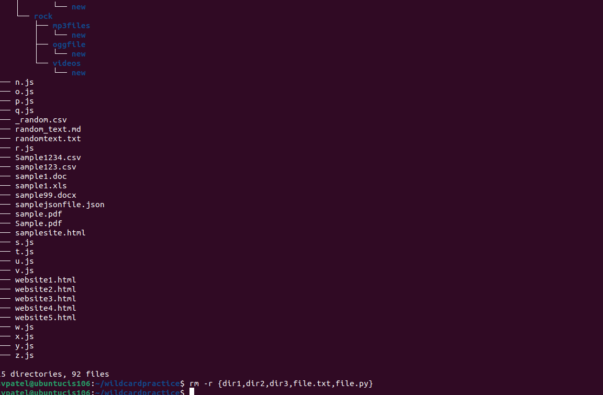

  
git pull
